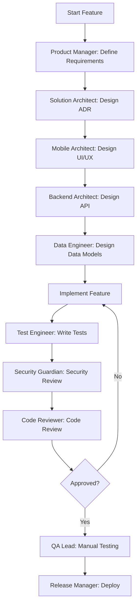

# Shared Workflows for Mobile Development

## Overview

This document outlines common workflows and collaboration patterns used across the RN Agents Framework. These workflows ensure consistency, quality, and efficiency when building React Native applications with Expo.

## Development Workflow

### 1. Feature Development Flow



### Step-by-Step Process

#### Phase 1: Planning (Product Manager)
1. Create user story with acceptance criteria
2. Define success metrics
3. Prioritize in backlog
4. Estimate effort

**Example User Story:**
```markdown
## User Story: Profile Picture Upload

**As a** mobile app user
**I want to** upload a profile picture from my device
**So that** I can personalize my account

**Acceptance Criteria:**
- [ ] User can tap profile picture to open camera or gallery
- [ ] User can select image from camera or photo library
- [ ] Image is resized to 500x500px before upload
- [ ] Upload shows progress indicator
- [ ] Profile picture updates immediately after upload
- [ ] Works offline (queues upload for later)
- [ ] Proper permission handling for camera and gallery
```

#### Phase 2: Architecture (Solution Architect)
1. Review technical requirements
2. Create or update ADR if needed
3. Identify potential technical risks
4. Define technical approach

**Example ADR:**
```markdown
# ADR 003: Image Upload Strategy

## Status
Accepted

## Context
Users need to upload profile pictures. We must handle:
- Large image files (multiple MB)
- Poor network conditions
- Battery and bandwidth concerns
- iOS and Android differences

## Decision
Use Expo Image Picker with:
- Client-side image compression (expo-image-manipulator)
- Background upload with queue system
- Supabase Storage for file storage
- Optimistic UI updates

## Consequences
- Reduces bandwidth usage by 80%
- Works offline with queue
- Requires Supabase Storage setup
- Need to handle upload failures gracefully
```

#### Phase 3: UI/UX Design (Mobile Architect)
1. Design component structure
2. Plan navigation flow
3. Consider gestures and animations
4. Ensure accessibility

**Component Plan:**
```typescript
// components/profile/ProfilePictureUploader.tsx
// - Shows current profile picture
// - Tap to open action sheet (camera/gallery)
// - Shows upload progress
// - Handles permissions
// - Displays errors

// Navigation:
// Profile Screen -> Action Sheet -> Camera/Gallery -> Upload -> Profile Screen
```

#### Phase 4: API Design (Backend Architect)
1. Design API endpoints
2. Define data contracts
3. Plan Supabase Edge Functions if needed
4. Document API

**API Design:**
```typescript
// Supabase Storage bucket: avatars
// Path structure: {user_id}/avatar.jpg

// Upload endpoint (Supabase Storage):
POST /storage/v1/object/avatars/{user_id}/avatar.jpg
Content-Type: multipart/form-data

// Update user profile (Supabase):
PATCH /rest/v1/users?id=eq.{user_id}
{
  "avatar_url": "https://supabase.co/storage/v1/object/public/avatars/{user_id}/avatar.jpg"
}
```

#### Phase 5: Data Modeling (Data Engineer)
1. Design database schema changes
2. Plan local storage strategy
3. Define sync logic
4. Create migration scripts

**Data Model:**
```sql
-- Users table already has avatar_url field
-- Add upload tracking for offline queue

CREATE TABLE IF NOT EXISTS upload_queue (
  id UUID PRIMARY KEY DEFAULT gen_random_uuid(),
  user_id UUID REFERENCES users(id),
  file_uri TEXT NOT NULL,
  destination TEXT NOT NULL,
  created_at TIMESTAMP DEFAULT NOW(),
  retry_count INTEGER DEFAULT 0,
  status TEXT DEFAULT 'pending'
);
```

#### Phase 6: Implementation
Developers implement the feature following the designs from architects.

#### Phase 7: Testing (Test Engineer)
1. Write unit tests
2. Write component tests
3. Write E2E tests
4. Ensure test coverage meets target

**Test Examples:**
```typescript
// __tests__/components/ProfilePictureUploader.test.tsx
describe('ProfilePictureUploader', () => {
  it('requests camera permission when camera selected', async () => {
    const { getByText } = render(<ProfilePictureUploader />);
    fireEvent.press(getByText('Take Photo'));
    expect(Camera.requestCameraPermissionsAsync).toHaveBeenCalled();
  });

  it('shows upload progress', async () => {
    const { getByTestId } = render(<ProfilePictureUploader />);
    await uploadImage();
    expect(getByTestId('upload-progress')).toBeTruthy();
  });
});
```

#### Phase 8: Security Review (Security Guardian)
1. Check for security vulnerabilities
2. Verify permission handling
3. Check data validation
4. Review secure storage usage

**Security Checklist:**
- ✅ Proper permission requests
- ✅ File type validation
- ✅ File size limits enforced
- ✅ Secure upload (HTTPS)
- ✅ No sensitive data in logs

#### Phase 9: Code Review (Code Reviewer)
1. Review code quality
2. Check best practices
3. Verify test coverage
4. Ensure documentation

#### Phase 10: QA Testing (QA Lead)
1. Manual testing on real devices
2. Test on both iOS and Android
3. Test edge cases and error scenarios
4. Verify acceptance criteria

#### Phase 11: Release (Release Manager)
1. Create release build with EAS
2. Submit to TestFlight/Play Console internal testing
3. Monitor for crashes
4. Promote to production

## Common Workflows

### Workflow 1: Adding a New Screen

1. **Mobile Architect** creates screen design
   ```typescript
   // app/(tabs)/settings.tsx
   export default function SettingsScreen() {
     return (
       <View className="flex-1 p-4">
         <Text className="text-2xl font-bold">Settings</Text>
       </View>
     );
   }
   ```

2. **Test Engineer** writes tests
   ```typescript
   describe('SettingsScreen', () => {
     it('renders settings title', () => {
       const { getByText } = render(<SettingsScreen />);
       expect(getByText('Settings')).toBeTruthy();
     });
   });
   ```

3. **Code Reviewer** reviews implementation
4. **QA Lead** tests on devices

### Workflow 2: Integrating a Native Module

1. **Native Modules Engineer** evaluates options
   - Check if Expo SDK has built-in support
   - If not, evaluate custom dev clients or expo modules

2. **Native Modules Engineer** implements integration
   ```bash
   npx expo install expo-camera
   ```

3. **Mobile Architect** creates wrapper component
   ```typescript
   // components/features/CameraView.tsx
   import { Camera } from 'expo-camera';
   
   export function CameraView() {
     const [permission, requestPermission] = Camera.useCameraPermissions();
     // ... implementation
   }
   ```

4. **Security Guardian** reviews permissions
5. **Test Engineer** tests on real devices
6. **Documentation Engineer** updates docs

### Workflow 3: Performance Optimization

1. **Performance Optimizer** profiles the app
   ```bash
   npx expo start --dev-client
   # Use React DevTools Profiler
   # Check bundle size with: npx expo export --dump-sourcemap
   ```

2. **Performance Optimizer** identifies issues
   - Large bundle size
   - Slow component renders
   - Memory leaks

3. **Mobile Architect** implements fixes
   ```typescript
   // Before: Inline function causes re-renders
   <Button onPress={() => handlePress()} />
   
   // After: Memoized callback
   const handlePress = useCallback(() => {
     // handle press
   }, []);
   ```

4. **Test Engineer** validates improvements
5. **Documentation Engineer** documents optimizations

### Workflow 4: Offline-First Feature

1. **Offline Architect** designs sync strategy
   ```typescript
   // Strategy: Queue operations, sync when online
   interface SyncStrategy {
     queueOperation: (op: Operation) => void;
     syncWhenOnline: () => Promise<void>;
     handleConflicts: (conflicts: Conflict[]) => void;
   }
   ```

2. **Data Engineer** implements local storage
   ```typescript
   // services/offlineQueue.ts
   export const offlineQueue = {
     async add(operation: Operation) {
       const queue = await localStorage.get('sync:queue') || [];
       queue.push(operation);
       await localStorage.set('sync:queue', queue);
     },
     // ... more methods
   };
   ```

3. **Backend Architect** updates API to support sync
4. **Mobile Architect** updates UI for offline state
5. **Test Engineer** tests offline scenarios

### Workflow 5: EAS Build and Deploy

1. **EAS Specialist** configures build
   ```json
   // eas.json
   {
     "build": {
       "production": {
         "android": {
           "buildType": "app-bundle"
         },
         "ios": {
           "buildConfiguration": "Release"
         }
       }
     }
   }
   ```

2. **EAS Specialist** triggers build
   ```bash
   eas build --platform all --profile production
   ```

3. **QA Lead** tests build on TestFlight/Play Console
4. **Release Manager** promotes to production
5. **Observability Engineer** monitors release

## Collaboration Patterns

### Pattern 1: Agent Handoff

When an agent completes their work, they hand off to the next agent:

```
@solution-architect I've created the user story for profile picture upload.
Please review and create an ADR for the technical approach.

User story: [link to story]
Key requirements: offline support, image compression, permission handling
```

### Pattern 2: Cross-Agent Review

Multiple agents review complex features:

```
@mobile-architect @backend-architect @security-guardian
Please review the authentication flow implementation:
- UI components ready (mobile-architect)
- API endpoints ready (backend-architect)
- Security review needed (security-guardian)

PR: [link]
```

### Pattern 3: Parallel Work

Some agents can work in parallel:

```
@mobile-architect: Design the UI components
@backend-architect: Design the API endpoints
@data-engineer: Design the data models

All for the new messaging feature. Let's sync in 2 hours.
```

## Quality Gates

Each workflow phase has quality gates:

### Planning Phase
- [ ] User story has clear acceptance criteria
- [ ] Success metrics defined
- [ ] Estimated and prioritized

### Architecture Phase
- [ ] ADR created if needed
- [ ] Technical approach documented
- [ ] Risks identified

### Implementation Phase
- [ ] Code follows conventions
- [ ] Tests written and passing
- [ ] Documentation updated

### Testing Phase
- [ ] Unit tests pass
- [ ] Component tests pass
- [ ] E2E tests pass (if applicable)
- [ ] Coverage meets target (80%)

### Security Phase
- [ ] No security vulnerabilities
- [ ] Permissions properly handled
- [ ] Data properly validated
- [ ] Sensitive data secured

### Release Phase
- [ ] Build successful on EAS
- [ ] Tested on real devices (iOS and Android)
- [ ] No critical bugs
- [ ] Ready for store submission

## Emergency Workflows

### Critical Bug Fix

1. **QA Lead** or **Observability Engineer** identifies critical bug
2. **Orchestrator** assigns to appropriate agent
3. **Developer** creates hotfix
4. **Test Engineer** writes regression test
5. **Code Reviewer** expedited review
6. **EAS Specialist** creates emergency build
7. **Release Manager** deploys via EAS Update (OTA)

### Security Incident

1. **Security Guardian** identifies vulnerability
2. **Solution Architect** assesses impact
3. **Backend Architect** or **Mobile Architect** implements fix
4. **Security Guardian** verifies fix
5. **Release Manager** emergency deployment

## Tools and Integrations

### Development
- **Version Control**: Git + GitHub
- **CI/CD**: GitHub Actions + EAS Build
- **Code Review**: GitHub Pull Requests
- **Testing**: Jest + React Native Testing Library + Detox/Maestro

### Monitoring
- **Crash Reporting**: Sentry
- **Analytics**: Amplitude, Mixpanel, or Expo Analytics
- **Performance**: React DevTools, Flashlight

### Communication
- **Documentation**: Markdown files in `/docs`
- **Issue Tracking**: GitHub Issues
- **Project Management**: GitHub Projects

## Best Practices

1. **Always start with planning** - Don't skip the product manager step
2. **Document architecture decisions** - Use ADRs for significant choices
3. **Test early and often** - Don't wait until the end to write tests
4. **Review security continuously** - Not just at the end
5. **Deploy incrementally** - Use feature flags for large features
6. **Monitor post-deployment** - Watch for issues in production
7. **Iterate based on feedback** - Continuous improvement

## Workflow Templates

### Feature Request Template
```markdown
## Feature Request

**Description**: [What is the feature?]
**User Story**: [As a... I want to... So that...]
**Priority**: [High/Medium/Low]
**Estimated Effort**: [Small/Medium/Large]

**Acceptance Criteria**:
- [ ] Criterion 1
- [ ] Criterion 2
- [ ] Criterion 3

**Technical Notes**: [Any technical considerations]
```

### Bug Report Template
```markdown
## Bug Report

**Description**: [What went wrong?]
**Steps to Reproduce**:
1. Step 1
2. Step 2
3. Step 3

**Expected Behavior**: [What should happen?]
**Actual Behavior**: [What actually happened?]

**Environment**:
- Device: [iPhone 15 / Pixel 8]
- OS Version: [iOS 17 / Android 14]
- App Version: [1.2.3]

**Screenshots**: [If applicable]
**Logs**: [If available]
```

## Summary

Following these workflows ensures:
- Clear communication between agents
- Consistent quality across features
- Proper documentation
- Comprehensive testing
- Secure implementation
- Smooth deployment

Each agent has a specific role, but all work together following these shared workflows to deliver high-quality React Native applications.
